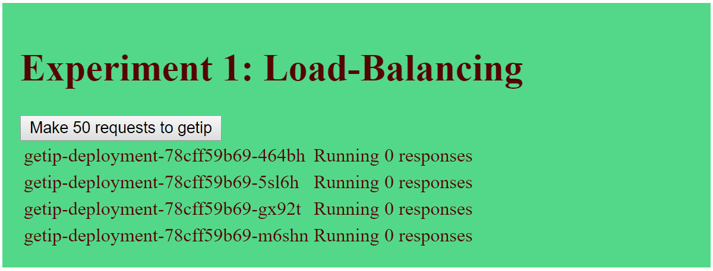
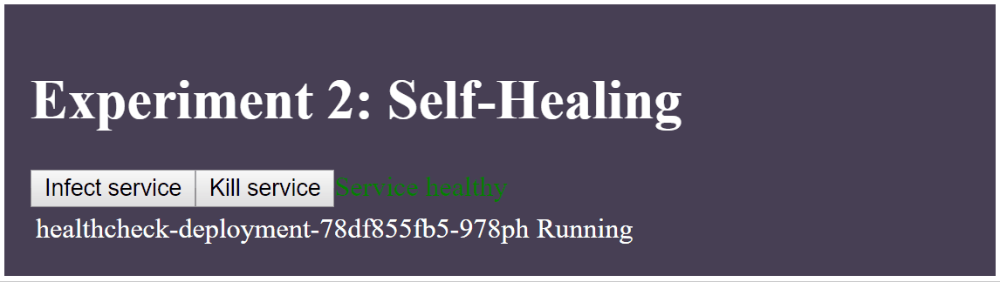
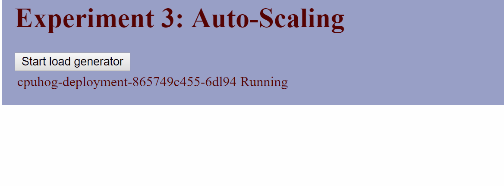

[](https://travis-ci.org/daniel-kun/kube-alive)

# Kubernetes: It's alive!

You can find a dashboard with experiments with Kubernetes (k8s) to observe it's behaviour in real scenarios in this project.
You should have a k8s cluster up and running to deploy the tools from this repository.

## Tested platforms

kube-alive is tested on the following platforms, with Kubernetes version 1.8 and 1.9:

- Minikube (see [official guide](https://kubernetes.io/docs/getting-started-guides/minikube/).)
- Bare metal on a Raspberry Pi 3 cluster (see [a guide by Scott Hanselman](https://www.hanselman.com/blog/HowToBuildAKubernetesClusterWithARMRaspberryPiThenRunNETCoreOnOpenFaas.aspx).)
- Microsoft Azure Container Service AKS (see [official guide](https://docs.microsoft.com/en-us/azure/aks/intro-kubernetes#using-azure-container-service-aks).)
- Google Kubernetes Engine GKE (see [official guide](https://cloud.google.com/kubernetes-engine/docs/quickstart).)

## Deployment

*Prerequisites:*
* You need to have `kubectl` installed and configured to point at a running cluster that you have admin access to.
* If you are running on Google Kubernetes Engine, your default account does not have the privilege to grant more privileges. To circumvent this, you can grant yourself cluster-admin rights: `kubectl create clusterrolebinding root-cluster-admin-binding --clusterrole=cluster-admin --user=<your-google-mail-address>`

You can deploy kube-alive to your local cluster with this single command:

```bash
curl -sSL https://raw.githubusercontent.com/daniel-kun/kube-alive/master/deploy.sh | bash
```

This will install the required resources into the `kube-alive` Kubernetes namespace.

# Experiments

Behaviours of k8s that can be observed "live":

## Load-Balancing
When a ReplicaSet with multiple Pods exists, see how results are served from different Pods via Kubernete's load balancing. Each Pod returns it's IP address and the Frontend shows you how many of your requests have been made by which Pod.



## Self-Healing
When an app crashes or becomes unhealthy (via health-check), see how the Pod is restarted and becomes healthy again.



## Auto-Scale
When traffic can not be served with a single Pod and CPU usage exceeds 50%, more Pods are created automatically and more requests are served.



## Rolling updates
When a deployment is updated, you see that new Pods are created and then old Pods are killed. (coming soon)

