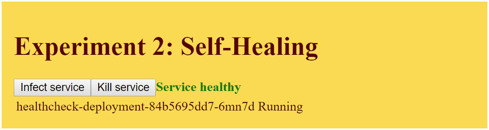

# Kubernetes: It's alive!

You can find a dashboard with experiments with Kubernetes (k8s) to observe it's behaviour in real scenarios in this project.
You should have a k8s cluster up and running on amd64 or arm32v7 to deploy the tools from this repository.
I used a Raspberry Pi cluster with five nodes and set them up as described by Scott Hanselman here: https://www.hanselman.com/blog/HowToBuildAKubernetesClusterWithARMRaspberryPiThenRunNETCoreOnOpenFaas.aspx. Or you can simply use a [minikube](https://kubernetes.io/docs/getting-started-guides/minikube/) on your local development box.

## Deployment

*Prerequisites:* You need to have `kubectl` installed and configured to point at a running cluster that you have admin access to. Supported CPU architectures are amd64 and arm32v7. It's tested on Kubernetes 1.9.1 on ubuntu on amd64 and raspbian on Raspberry Pis. You can even get this running on Windows by using minikube and [Windows Subsystem for Linux](https://docs.microsoft.com/en-us/windows/wsl/install-win10) with Ubuntu.

You can deploy kube-alive to your local cluster with this single command:

```bash
curl -sSL https://raw.githubusercontent.com/daniel-kun/kube-alive/master/deploy.sh | bash
```

This will install the required resources into the `kube-alive` Kubernetes namespace.

# Experiments

Behaviours of k8s that can be observed "live":

## Load-Balancing
When a ReplicaSet with multiple Pods exists, see how results are served from different Pods via Kubernete's load balancing. Each Pod returns it's IP address and the Frontend shows you how many of your requests have been made by which Pod.


## Self-Healing
When an app crashes or becomes unhealthy (via health-check), see how the Pod is restarted and becomes healthy again.



## Auto-Scale
When traffic can not be served with a single Pod and CPU usage exceeds 50%, more Pods are created automatically and more requests are served.


## Rolling updates
When a deployment is updated, you see that new Pods are created and then old Pods are killed. (coming soon)

